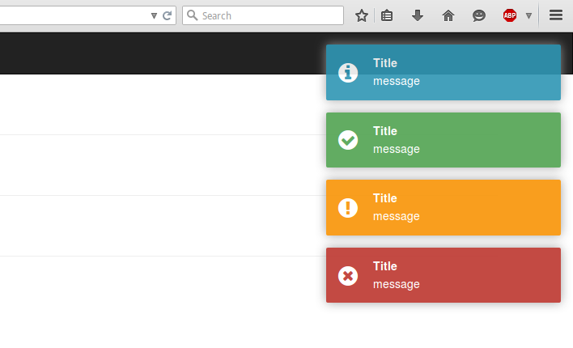

# React Notifications

[](http://vn38minhtran.github.io/react-notifications)

## Installation

```
npm install --save react-notifications
```

## Usage

### CSS

#### Webpack:
```js
import 'react-notifications/lib/notifications.css';
// or
require('react-notifications/lib/notifications.css);
```

#### Other
```html
<link rel="stylesheet" type="text/css" href="path/to/notifications.css">
```

### JS

```js
import Notifications from 'react-notifications';

let notifications = [
  {
    id: 1,
    title: 'Title',
    message: 'Message'
  },
  {
    id: 2,
    title: 'Title',
    message: 'Message'
  }
];

let handleRequestHide = (notification) => {
  notifications = notifications.filter(n => n.id !== notification.id);
};

<Notifications notifications={notifications} onRequestHide={handleRequestHide}/>
```

## Props

- notifications: [] : Array of notification object.
- onRequestHide: function(notification) : Callback function

## Notification object

```js
{
  id: [number],
  title: [string],
  message: 'string',
  timeOut: [milliseconds],
  onClick: [function]
}

// [] is optional.
```

## Example
View [demo](http://vn38minhtran.github.io/react-notifications) or example folder.